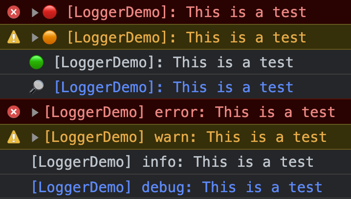
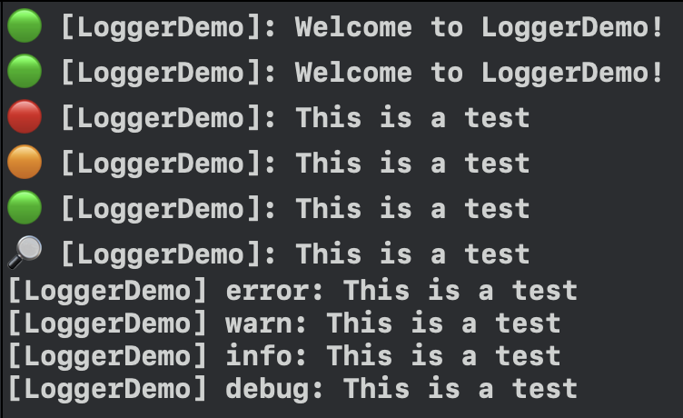
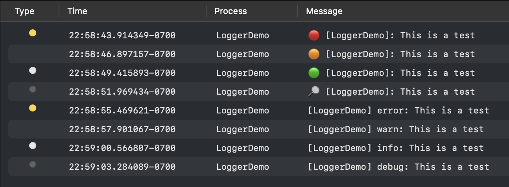
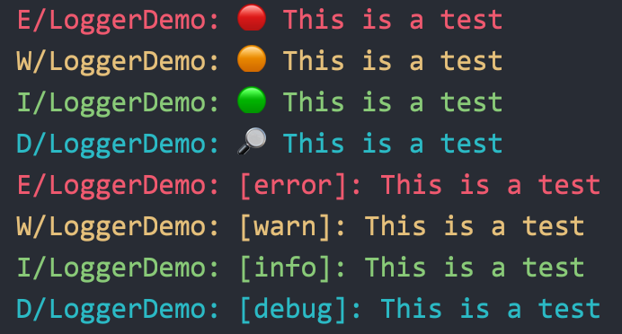

<div class="markdown-body">

# capacitor-logger&nbsp;&nbsp;[](https://badge.fury.io/js/@aparajita%2Fcapacitor-logger)

This [Capacitor 4](https://capacitorjs.com) plugin is an almost complete implementation of the [`Console`](https://developer.mozilla.org/en-US/docs/Web/API/Console) interface for web, iOS and Android.

A [demo](https://github.com/aparajita/capacitor-logger-demo) is available that illustrates the usage of the API.

[Installation](#installation) | [Configuration](#configuration) | [Usage](#usage) | [API](#api)

## Features

- Does not attempt to monkey patch the `Console` interface, uses a separate `Logger` class.
- Set a [log level](#log-levels) — including `silent` — for the logger.
- Completely filter out logs based on the log level.
- Logs are **not** part of Capacitor’s output, you get your own distinct tag.
- Customize the log labels, including using emoji. 😁
- Send logs to the system log on iOS, so you can view a production app’s logs on any device using `Console.app`. 🎉
- Instantiate multiple loggers.
- `Logger` class is available for use by native plugins and apps! 🚀

### Log levels

`Logger` uses the same log levels as `Console`, from lowest to highest: `error`, `warn`, `info`, and `debug`. In addition, `silent` is used to disable all logging. These are all defined in the [`LogLevel`](#loglevel) enum.

Unlike `Console`, each instance of `Logger` has its own log level which determines what is logged. You can change the level at any time by setting the `.level` property to a `LogLevel` or a level name. If the level name is invalid, it is ignored.

For any given log message, there is a log level associated. If the logger’s current log level is less than the log message’s level, the message is ignored. For example, if the current log level is `info` and a `debug` message is logged, it will be ignored, because `info` is a lower level than `debug`.

> **Note:** It is a known bug that iOS simulators will not log debug messages to the system log.

### Distinct (and distinctive!) log output

If you use `console` methods, your logs go through Capacitor and don’t exactly stand out. Hey Capacitor, my app can stand on its own! 😁 With `Logger`, you can configure a custom label for each level as well as a tag that identifies the source of the log message.

#### Level labels

There are two styles of level labels: emoji and text. The style determines how the label is displayed. By default, the label is displayed as an emoji. The default (boring) labels are:

```
error: '🔴',
warn: '🟠',
info: '🟢',
debug: '🔎',
```

You can set the labels to whatever you want using the `.labels` property. For example, you could use something with a little more character:

```
error: '☠️',
warn: '👀',
info: '💬',
debug: '🪰',
```

Here is a sample of what emoji and text labels look like in a browser console:



And in the Xcode console:



And in macOS `Console.app` 🎉:



And in Android logcat:



Note that on Android, if the first character of a label is ASCII, the label is automatically surrounded by square brackets.

## Installation

The `Logger` class provided by this plugin is implemented in TypeScript (web), Swift (iOS) and Java (Android), and is exported for use within your own native code.

In your plugin or app project:

```shell
pnpm add @aparajita/capacitor-logger
```

If you only plan to use the logger from TypeScript code (even on native platforms), this is all you need to do.

One of the original motivations for this plugin was to have better logging from my other plugins. If you are a plugin author, or writing native code at the app layer, you can use a native `Logger` class in your native code. To use the logger in your plugins, you must add it both to the plugin **_and_** to any app that uses your plugin, because the dependency is not transitive.

If you are want to use `Logger` in your plugins, there are a few more installation steps to take. In the following examples we will assume your plugin is called `MyPlugin`.

### iOS

1. Add a reference to this plugin in `MyPlugin.podspec`.

```podspec
Pod::Spec.new do |s|
  # ...standard stuff
  s.dependency 'Capacitor'

  # 👇 Add this
  s.dependency 'AparajitaCapacitorLogger'

  s.swift_version = '5.1'
end
```

2. Add a reference to this plugin in `ios/Podfile`.

```podfile
# 👇 Add this
def my_pods
  pod 'AparajitaCapacitorLogger', :path => '../node_modules/@aparajita/capacitor-logger'
end

target 'Plugin' do
  capacitor_pods

  # 👇 Add this
  my_pods
end

target 'PluginTests' do
  capacitor_pods

  # 👇 Add this
  my_pods
end
```

Add this plugin as a peer dependency in your plugin’s `package.json`.

```json
{
  "peerDependencies": {
    "@aparajita/capacitor-logger": "^1.0.0"
  }
}
```

### Android

1. Add a reference to this plugin in your plugin’s `settings.gradle (android)`.

```gradle
include ':aparajita-capacitor-logger'
project(':aparajita-capacitor-logger').projectDir = new File('../node_modules/@aparajita/capacitor-logger')
```

2. Add a reference to this plugin in your plugin’s `build.gradle (android)`.

```gradle
dependencies {
  implementation ':aparajita-capacitor-logger'
}
```

## Usage

The `Logger` API is similar across web, Swift and Java. In Swift I have used as many idiomatic features of the language as possible to make coding easier (yeah Java, I’m looking at you).

### TypeScript

To use the logger in TypeScript , import it into your project:

```typescript
import { Logger } from '@aparajita/capacitor-logger'
```

Then create a logger instance:

```typescript
// You can also pass the level and labels here if you want.
const logger = new Logger('MyApp')
```

If you are only using a single logger for the entire app, you will probably want to put this code in a separate file:

```typescript
// logger.ts
import { Logger } from '@aparajita/capacitor-logger'

const logger = new Logger('MyApp')
export default logger
```

Then import the logger into your code:

```typescript
import logger from '@/logger'

logger.info('Hello world!')
```

### Swift

In your plugin or app’s Swift code where you want to instantiate the logger, import the logger module:

```swift
import AparajitaCapacitorLogger
```

If you want to use a hard-coded log tag, create a logger instance anywhere you want:

```swift
let logger = Logger(withTag: "MyPlugin")
```

If you are writing a plugin and want to use your plugin’s name as the log tag, you have to split up the declaration and instantiation into two lines, because the plugin is not fully constructed until `load()`:

```swift
@objc(SplashScreen)
public class SplashScreen: CAPPlugin {
  var logger: Logger?

  override public func load() {
    logger = Logger(withPlugin: self)
  }
```

Then use the logger anywhere you want:

```swift
// If you intantiated directly
logger.info("Hello world!")

// If you used an optional
logger?.info("Hello world!")
```

If you want to use a logger in the application layer and use the application’s display name as its tag, there is a convenience initializer you can use. First declare the logger in your `AppDelegate`.

```swift
import UIKit
import AparajitaCapacitorLogger
import Capacitor

@UIApplicationMain
class AppDelegate: UIResponder, UIApplicationDelegate {

  var window: UIWindow?
  var logger: Logger?
```

If you don’t care about using the Capacitor config file, you can initialize the logger in `application(_:didFinishLaunchingWithOptions)`.

```swift
func application(_ application: UIApplication, didFinishLaunchingWithOptions launchOptions: [UIApplication.LaunchOptionsKey: Any]?) -> Bool {
  // Override point for customization after application launch.
  logger = Logger(withAppDelegate: self)
  logger?.info("ready to roll!")
  return true
}
```

If you want the Capacitor config file to be used, you have to initialize the logger the first time `applicationDidBecomeActive` is called, because config is not available before then.

```swift
func applicationDidBecomeActive(_ application: UIApplication) {
  // Restart any tasks that were paused (or not yet started) while the application was inactive. If the application was previously in the background, optionally refresh the user interface.

  if logger == nil {
    logger = Logger(withAppDelegate: self)
    logger?.info("ready to roll!")
  }
}
```

### Android

Import the `logger` module in your plugin’s code:

```java
import com.aparajita.capacitor.logger.*;

```

If you want to use a hard-coded log tag, create a logger instance anywhere you want:

```java
Logger logger = new Logger("MyPlugin");
```

If you are writing a plugin and want to use your plugin’s name as the log tag, you have to split up the declaration and instantiation into two lines, because the plugin is not fully constructed until `load()`:

```java
@CapacitorPlugin(name = "MyPlugin")
public class MyPluin extends Plugin {

  private Logger logger;

  @Override
  public void load() {
    logger = new Logger(this);
  }
}

```

Then use the logger anywhere you want:

```java
logger.info("Hello world!")
```

If you want to use a logger in the application layer and use the application’s display name as its tag, there is a convenience constructor you can use. First declare the logger in your `MainActivity`.

```swift
import com.aparajita.capacitor.logger.*;

public class MainActivity extends BridgeActivity {
  private Logger logger;
```

Then construct the logger in `load()`. This constructor will fetch the tag from the app’s display name and also read the Capacitor config.

```swift
@Override
protected void load() {
  super.load();
  logger = new Logger(this);
}
```

## Configuration

Loggers can be configured at runtime through various class methods. For loggers created _within native code_, you can also configure the initial state by setting values in the Capacitor config file of any app that installs this plugin. The configuration schema is as follows:

```typescript
const config: CapacitorConfig = {
  plugins: {
    Logger: {
      // Everything below is optional
      level: LogLevelName,
      labels: {
        // You can define only the labels you want to change from the default
        error: string,
        warn: string,
        info: string,
        debug: string
      },
      useSyslog: boolean // Only used on iOS
    }
  }
}
```

Config values are read in `Logger` constructors that are passed a plugin, and are overridden by any config options you pass to the constructor.

## API

The functionality of `Logger` is the same on each of the three platforms, but the API is slightly different.

### Web (TypeScript)

```typescript
enum LogLevel {
  silent,
  error,
  warn,
  info,
  debug
}

// This resolves to the type union 'error' | 'warn' | 'info' | 'debug'
type LogLevelName = Exclude<keyof typeof LogLevel, 'silent'>

// Returned by the .labels getter and passed to the setter.
// It's a map of level names to corresponding labels.
type LogLevelMap = { [key in LogLevelName]?: string }

// Options passed to the constructor
interface Options {
  level?: LogLevel
  labels?: LogLevelMap
  useSyslog?: boolean  // only used on iOS
}

class Logger {
	constructor(tag: string, options?: Options) {}

  // Get the current log level for this logger
  get level(): LogLevel {}

  // Set the current log level for this logger
  set level(level: LogLevel | string) {}

  // Get the current log level as a string
  get levelName(): string {}

  // Set the current log level as a string.
  // If the name is invalid, it is ignored.
  set levelName(level: string) {}

  // Returns the LogLevel enum for the given name,
  // or undefined if the name is invalid.
  getLevelWithName(name: string): LogLevel | undefined {}

  // Returns a copy of a map between log level names and labels
  get labels(): LogLevelMap {}

  // Sets the mapping between log level names and labels.
  // Invalid level names or empty labels are ignored.
  set labels(labels: LogLevelMap) {}

  // Get the current log tag
  get tag(): string {}

  // Set the current log tag. If `tag` is empty, it is ignored.
  set tag(tag: string) {}

  // The following methods log a message at the given level.
  // This is the main interface you will use to the `Logger` class.

  // Unlike `console.<level>`, if the current log level of the logger
  // is less than the level of the method, the message is ignored.

  // Also unlike `console.<level>`, you can only pass a single parameter.
  // The multi-parameter console methods were created in the days
  // before we had template strings, so a single string is enough.

  // silent() is there to facilitate dynamically calling
  // a logging method based on the level name without needing
  // to special-case 'silent'.
  silent(message: string) {}
  error(message: string) {}
  warn(message: string) {}
  info(message: string) {}
  log(message: string) {}  // alias for info()
  debug(message: string) {}

  // Logs a message at the given level. If `level` is
  // an invalid level name, the level defaults to info.
  logAtLevel(level: LogLevel | string, message: string) {}

  // Same as `logAt`, but you can also specify the tag.
  logWithTagAtLevel(level: LogLevel | string, tag: string, message: string) {}

  // Logs a debug representation of a value at the info level.
  dir(item: unknown) {}

  // Clears the console on the web, does nothing on native platforms.
  clear() {}

  // These are the exact equivalents of the console timer methods,
  // but are implemented on all platforms.
  time(label?: string | undefined) {}
  timeLog(label?: string) {}
  timeEnd(label?: string) {}

  // These methods are passed through to `console` on the web
  // and do nothing on native platforms.
  count(label?: string | undefined) {}
  countReset(label?: string | undefined) {}
  group(...label: any[]) {}
  groupCollapsed(...label: any[]) {}
  groupEnd() {}
  table(tabularData: any, properties?: readonly string[] | undefined) {}

  // Logs a stack trace at the current point of execution
  trace() {}

  // Returns whether logging should be routed to the system log on iOS.
  get useSyslog(): boolean {}

  // Sets whether logging should be routed to the system log on iOS.
  set useSyslog(use: boolean) {}
```

### iOS (Swift)

```swift
public class Logger {
  public enum LogLevel: Int {
    case silent = 0
    case error
    case warn
    case info
    case debug

    // The equivalent of `getLevelWithName()` in TypeScript.
    // Returns the LogLevel with the given name, or nil if invalid.
    public static subscript(_ str: String) -> LogLevel? {}
  }

  // Use this to pass options to the Logger initializer
  public struct Options {
    public var level: LogLevel?
    public var labels: [String: String]?
    public var useSyslog: Bool?

    // Initializer for Options
    public init(
      level: LogLevel = LogLevel.info,
      labels: [String: String] = [:],
      useSyslog: Bool = false
    ) {}
  }

  // The exact equivalent of `labels` property in TypeScript. Lets you
  // get and set level labels as a map of level names to labels.
  public var labels: [String: String]

  // The current log level
  public var level: LogLevel

  // The current log tag. When setting, an empty tag is ignored.
  public var tag: String

  // Whether to log to the system log, defaults to false
  public var useSyslog: Bool

  // Initialize a logger with the given app delegate using the
  // app's bundle display name as the tag and reading config from disk
  // (see Configuration above).
  public convenience init(
    withAppDelegate delegate: UIApplicationDelegate,
    options: Options? = nil
  ) {}

  // Initialize a logger with the given plugin, using the plugin's name as the tag,
  // and reading config from disk (see Configuration above).
  public convenience init(withPlugin plugin: CAPPlugin, options: Options?) {}

  // Initialize a logger with the given tag and options.
  public convenience init(
    withTag tag: String,
    options: Options? = nil
  ) {}

  // Level logging methods
  public func error(_ message: String) {}
  public func warn(_ message: String) {}
  public func info(_ message: String) {}
  public func log(_ message: String) {}  // alias for info()
  public func debug(_ message: String) {}

  // Generic logging methods
  public func log(atLevel level: LogLevel, message: String) {}
  public func log(
    atLevel: level: LogLevel,
    label: String?,
    tag: String,
  	message: String) {}

  // Log a debug representation of a value at info level
  public func dir(_ value: Any?) {}

  // Implementation of the console timer methods
  public func time(_ label: String?) {}
  public func timeLog(_ label: String?) {}
  public func timeEnd(_ label: String?) {}

  // Logs a stack trace at the current point of execution on all platforms
  public func trace() {}
}
```

### Android (Java)

```java
public class Logger {

  public enum LogLevel {
    silent,
    error,
    warn,
    info,
    debug
  }

  // Options passed to Logger constructor
  public static class Options {

    LogLevel level;
    Map<String, String> labels;

    // Make default options: level = info, labels = null
    Options() {}

    // Copy constructor
    Options(Options other) {}

    Options(LogLevel level) {}

    Options(Map<String, String> labels) {}

    Options(LogLevel level, Map<String, String> labels) {}
  }

  // The current log level
  public LogLevel level;

  // Construct a logger with the given activity, using the apps's display
  // name as the tag, log level of info, default labels, and reading config
  // from disk (see Configuration above).
  public Logger(@NonNull BridgeActivity activity) {}

  // Same as above, but passing options that will override level and labels
  public Logger(@NonNull BridgeActivity activity, Options options) {}

  // Construct a logger with the given plugin, using the plugin's name as the tag,
  // log level of info, default labels, and reading config from disk
  // (see Configuration above).
  public Logger(Plugin plugin) {}

  // Same as above, but passing options that will override level and labels
  public Logger(Plugin plugin, Options options) {}

  // Construct a logger with the given tag and default level and labels
  public Logger(String tag) {}

  // Same as above, but passing options that will override level and labels
  public Logger(String tag, Options options) {}

  // Return the LogLevel with the given name, or null if invalid
  @Nullable
  public Object getLevelWithName(String name) {}

  // Return the name of the current log level
  public String getLevelName() {}

  // Set the current level by name. Invalid names are ignored.
  public void setLevelName(String name) {}

  // Return a map of level names to level labels
  public Map<String, String> getLabels() {}

  // Set level labels given a map of level names to labels.
  // Invalid level names are ignored.
  public void setLabels(Map<String, String> labels) {}

  // Return the current tag
  public String getTag() {}

  // Set the tag. An empty string is ignored.
  public void setTag(String tag) {}

  // Level logging methods
  public void error(String message) {}

  public void warn(String message) {}

  public void info(String message) {}

  public void log(String message) {} // alias for info()

  public void debug(String message) {}

  // Generic logging
  public void logAtLevel(LogLevel level, String message) {}

  public void logWithTagAtLevel(LogLevel level, String tag, String message) {}

  public void logWithTagAtLevel(
    LogLevel level,
    String label,
    String tag,
    String message
  ) {}

  // Generic logging. If level is an invalid level name, defaults to info.
  public void logAtLevel(String level, String message) {}

  public void logWithTagAtLevel(String level, String tag, String message) {}

  // Log a debug representation of a value at info level
  public void dir(Object value) {}

  // Implementation of the console timer methods
  public void time() {}

  public void time(String label) {}

  public void timeLog() {}

  public void timeLog(String label) {}

  public void timeEnd() {}

  public void timeEnd(String label) {}

  // Logs a stack trace at the current point of execution on all platforms
  public void trace() {}
}

```

</div>
